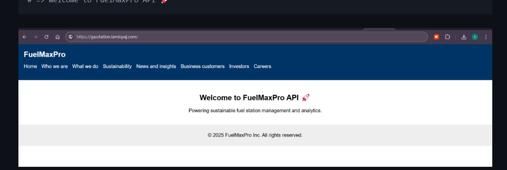

# ⛽ FuelMaxPro — AWS Infrastructure + Node.js API

A cloud-native fuel station API deployed using **Terraform** and **Node.js**, hosted entirely on AWS.  
Features a MySQL backend, scalable Node.js API, custom domain routing, GitHub Actions CI/CD, and OWASP ZAP security scanning.

---

## 🌟 Features

- ⚙️ Infrastructure as Code (Terraform with remote S3 backend and DynamoDB locking)
- 💾 MySQL database on Amazon RDS
- 🛰 Node.js REST API deployed on EC2 Auto Scaling Groups
- 🔐 Secure credentials using AWS Secrets Manager
- 🌐 HTTPS via ACM + Route 53 DNS
- ☁️ Application artifact (ZIP) managed in S3 via CI/CD
- 🧪 OWASP ZAP Dynamic Application Security Testing (DAST)
- 🔁 Full CI/CD pipeline with GitHub Actions

---

## ✅ Prerequisites

Before running Terraform or pushing code, complete these **manual AWS Console setups**:

---

### 🛠️ Manual AWS Console Prerequisites

---

### 1. 📜 Route 53 Hosted Zone and Domain

- **Buy or own a domain** (e.g., `yourdomain.com`).
- **Create a hosted zone** in Route 53 for that domain.
- **Record** the domain and subdomain you want in `terraform.tfvars`:

```hcl
hosted_zone_name = "yourdomain.com"
subdomain_record = "gasstation"
```

---

### 2. 📦 Create S3 Bucket for Terraform State

- **Go to AWS Console → S3 → Create bucket**
- Bucket Name: `fuelmaxpro-tf-state`
- Region: `us-east-2 (Ohio)`
- Default settings are fine (optional: enable encryption/versioning).

---

### 3. 🗄️ Create DynamoDB Table for Terraform Locking

- **Go to AWS Console → DynamoDB → Create table**
- Table Name: `terraform-locks`
- Partition Key:
  - Name: `LockID`
  - Type: `String`
- Default settings (On-Demand billing) are fine.

_Update `main.tf` backend block to use these:_

```hcl
terraform {
  backend "s3" {
    bucket         = "fuelmaxpro-tf-state"
    key            = "infrastructure/terraform.tfstate"
    region         = "us-east-2"
    dynamodb_table = "terraform-locks"
    encrypt        = true
  }
}
```

---

### 4. ☁️ Create S3 Bucket for App Artifact Storage

✅ **No manual app upload needed anymore.**  
The GitHub Actions pipeline will automatically:

- Package the Node.js app into a `gasstation-app.zip`
- Upload the ZIP file to this bucket

You only need to create the bucket:

- **Go to AWS Console → S3 → Create Bucket**
- Bucket Name: `fuelmaxpro-app-artifacts`
- Region: `us-east-2 (Ohio)`

---

### 5. 🔐 Create Secrets Manager Secret for DB Credentials

- **Go to AWS Console → Secrets Manager → Store a new secret**
- Select **Other type of secret**.
- **Secret Name**: `fuelmaxpro-db-credentials`
- **Secret Value (JSON)**:

```json
{
  "name": "admin",
  "password": "YourSecurePassword123!"
}
```

---

### 6. 🔑 Create EC2 Key Pair

- **Go to AWS Console → EC2 → Key Pairs → Create Key Pair**
- **Key Name**: `tristy`
- Save the `.pem` file securely.

_Reference this in `terraform.tfvars`:_

```hcl
key_name = "tristy"
```

---

## 🧱 Terraform Setup

Install Terraform CLI version ≥ 1.3:

```bash
terraform version
```

---

## 🚀 Deploy Infrastructure

```bash
cd terraform
terraform init
terraform apply -auto-approve
```

---

## 🌐 Test the API

```bash
curl https://gasstation.yourdomain.com/ (https://gasstation.tamispaj.com/)

```

---

## 📦 API Endpoints

| Method | Route        | Description            |
|--------|--------------|-------------------------|
| GET    | `/stations`  | List all fuel stations  |
| POST   | `/stations`  | Add a new station record |

---

## 🧪 Example POST Payload

```json
{
  "name": "FuelX Premium",
  "location": "Miami, FL",
  "fuel_type": "Diesel"
}
```

---

## 🔐 Environment Variables (.env)

The `.env` file is **generated dynamically** on the EC2 instance during startup:

```env
DB_HOST=<your-rds-endpoint>
DB_USER=<username-from-secrets-manager>
DB_PASS=<password-from-secrets-manager>
DB_NAME=gasstations
PORT=3000
```

---

## 🧠 Manual SQL Schema Init (Optional)

```sql
CREATE DATABASE gasstations;

USE gasstations;

CREATE TABLE stations (
  id INT AUTO_INCREMENT PRIMARY KEY,
  name VARCHAR(100),
  location VARCHAR(255),
  fuel_type VARCHAR(50),
  created_at TIMESTAMP DEFAULT CURRENT_TIMESTAMP
);
```


---

# 🔁 GitHub Actions CI/CD Pipeline

The GitHub Actions workflow at `.github/workflows/deploy-gas-station.website.yml` automates deployment on **every push to `main`**.

---

## 📦 1. Upload Artifact to S3 (`upload-artifact`)

- **Checkout** repository
- **Configure AWS credentials**
- **Validate** `S3_BUCKET_NAME` exists
- **Zip and upload** the app into S3 automatically

✅ No manual upload needed!

---

## 🛠️ 2. Terraform Apply (`terraform-deploy`)

- **Checkout** repository
- **Install Terraform v1.6.6**
- **Terraform init** using S3 + DynamoDB backend
- **Terraform apply** to deploy VPC, EC2, ALB, RDS, etc.

---

## 🛡️ 3. DAST Scan with OWASP ZAP (`dast-scan`)

- **Wait** until the app is reachable at `https://gasstation.tamispaj.com/`
- **Run** OWASP ZAP Dynamic scan
- **Generate reports** (`html`, `markdown`, `json`)
- **Upload reports** as GitHub artifacts

---


## ✅ Pipeline Summary

| Stage            | Purpose                      | Output               |
|------------------|-------------------------------|-----------------------|
| upload-artifact  | Upload app ZIP to S3 bucket    | `gasstation-app.zip` |
| terraform-deploy | Deploy AWS infrastructure     | EC2, ALB, RDS created |
| dast-scan        | Run OWASP security scan        | `zap_report.html`    |

---

## 📁 Project Structure

```
app/
├── app.js               # Express API entry
├── db.js                # MySQL connection via Secrets Manager
├── package.json         # Node.js dependencies
├── routes/
│   └── stations.js      # API routes
├── public/
│   └── css/styles.css   # Frontend assets
├── views/
│   └── index.html       # Landing page
└── README.md            # Project documentation
```

---

## 🧠 Git Workflow

```bash
# Clone repository
git clone https://github.com/terencetatefua/gas-station-website.git

cd gas-station-website

# Pull latest changes
git pull origin main

# Check repo status
git status

# Stage changes
git add .

# Commit changes
git commit -m "updated readme"

# Push changes
git push origin main
```

---
 Clean Up
To tear down everything:

terraform destroy -auto-approve


## 👷‍♂️ Author

Built by **@terencetatefua**  


---
