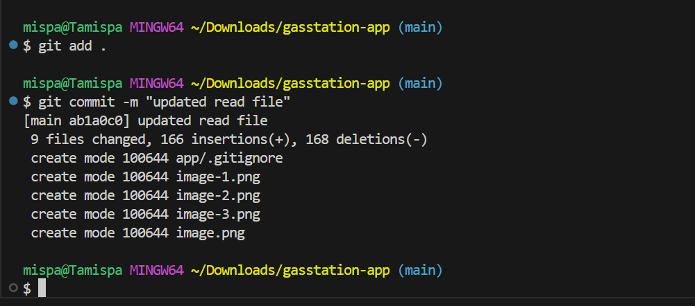
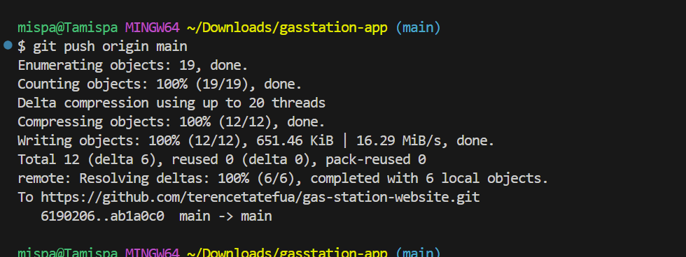

# ⛽ FuelMaxPro — AWS Infrastructure + Node.js API

A complete cloud-native fuel station API application deployed using **Terraform** and **Node.js**, hosted on AWS infrastructure. Includes a MySQL backend, auto-scaling EC2 instance, custom domain via Route 53, and CI/CD with GitHub Actions.

---

## 🌟 Features

- ⚙️ Terraform IaC w/ remote S3 backend + DynamoDB locking  
- 💾 MySQL on RDS (secured via AWS Secrets Manager)  
- 🛰 EC2 deployment using PM2, ALB, and Launch Templates  
- 🔐 HTTPS via ACM + Route 53  
- ☁️ S3-hosted app ZIP artifact  
- 🧪 OWASP ZAP DAST scan in CI/CD  
- 📊 Node.js REST API for fuel station data

---

## ✅ Manual AWS Prerequisites

These must be created **via AWS Console** before using Terraform:

### 🔹 1. Route 53 Hosted Zone + Domain

- Own a registered domain (e.g., `yourdomain.com`)
- Hosted Zone must exist in Route 53

Update `terraform.tfvars`:

```hcl
hosted_zone_name = "yourdomain.com"
subdomain_record = "gasstation"
```

---

### 🔹 2. Terraform S3 Backend + Locking Table

Create these manually:

```bash
# S3 Bucket for Terraform state
aws s3api create-bucket --bucket fuelmaxpro-tf-state --region us-east-2

# DynamoDB Table for state locking
aws dynamodb create-table \
  --table-name terraform-locks \
  --attribute-definitions AttributeName=LockID,AttributeType=S \
  --key-schema AttributeName=LockID,KeyType=HASH \
  --billing-mode PAY_PER_REQUEST
```

Update `main.tf`:

```hcl
terraform {
  backend "s3" {
    bucket         = "fuelmaxpro-tf-state"
    key            = "infrastructure/terraform.tfstate"
    region         = "us-east-2"
    dynamodb_table = "terraform-locks"
    encrypt        = true
  }
}
```

---

### 🔹 3. S3 App Artifact Bucket

Manually create and upload the Node.js app ZIP:

```bash
zip -r gasstation-app.zip . -x "*.env"
aws s3 cp gasstation-app.zip s3://fuelmaxpro-app-artifacts/latest/
```

---

### 🔹 4. Secrets Manager DB Credentials

Create a secret manually:

- Name: `fuelmaxpro-db-credentials`
- Value:

```json
{
  "name": "admin",
  "password": "YourSecurePassword123!"
}
```

---

### 🔹 5. EC2 Key Pair

Create a key pair in `us-east-2`:

```bash
aws ec2 create-key-pair --key-name tristy
```

Then in `terraform.tfvars`:

```hcl
key_name = "tristy"
```

---

## 🧱 Terraform Setup

Install Terraform CLI (≥ 1.3):

```bash
terraform version
```

---

## 🚀 Deploy

```bash
cd terraform
terraform init
terraform apply -auto-approve
```

---

## 🌐 Test API

```bash
curl https://gasstation.yourdomain.com/
```

---

## 📦 API Endpoints

| Method | Route       | Description              |
|--------|-------------|--------------------------|
| GET    | `/stations` | List all stations        |
| POST   | `/stations` | Add a new station record |

---

## 🧪 Example POST Payload

```json
{
  "name": "FuelX Premium",
  "location": "Miami, FL",
  "fuel_type": "Diesel"
}
```

---

## 🔐 Environment Variables (`.env`)

The `.env` file is **automatically created** on the EC2 instance during bootstrapping and contains:

```env
DB_HOST=fuelmaxpro-db.c9us4g4qomr0.us-east-2.rds.amazonaws.com
DB_NAME=gasstations
PORT=3000
```

> ✅ No need to manually create or commit this file — it's injected by the bootstrap script.

---

## 🧠 Manual DB Init (SQL)

```sql
CREATE DATABASE gasstations;

USE gasstations;

CREATE TABLE stations (
  id INT AUTO_INCREMENT PRIMARY KEY,
  name VARCHAR(100),
  location VARCHAR(255),
  fuel_type VARCHAR(50),
  created_at TIMESTAMP DEFAULT CURRENT_TIMESTAMP
);
```

---

## 🔁 GitHub Actions CI/CD Pipeline

A fully automated CI/CD workflow is configured in `.github/workflows/deploy.yml`.  
It runs **on every push to the `main` branch** and consists of **three jobs**:

---

### 📦 1. Upload Artifact to S3 (`upload-artifact`)

Prepares and uploads your app ZIP to S3.

#### Steps:

- 📥 Checkout repo  
- 🔐 Configure AWS credentials  
- 🛡️ Validate `S3_BUCKET_NAME` secret  
- 🚚 Upload `gasstation-app.zip` to:  
  `s3://${{ secrets.S3_BUCKET_NAME }}/latest/gasstation-app.zip`

---

### 🛠️ 2. Terraform Apply (`terraform-deploy`)

Initializes and applies infrastructure using Terraform.

#### Steps:

- 📥 Checkout repo  
- 🔐 Configure AWS credentials  
- 📦 Install Terraform v1.6.6  
- ⚙️ Run `terraform init` with S3 backend  
- ✅ Apply infrastructure via `terraform apply -auto-approve`

---

### 🛡️ 3. DAST Scan with OWASP ZAP (`dast-scan`)

Performs a dynamic vulnerability scan on your live app.

#### Steps:

- 📥 Checkout repo  
- ⏳ Wait for `https://gasstation.tamispaj.com/` to be live  
- 🔍 Run OWASP ZAP with:  
  - `zap_report.html`  
  - `zap_report.md`  
  - `zap_report.json`  
- 📤 Upload report to GitHub as artifact

---

### ✅ Pipeline Summary

| Stage            | Purpose               | Key Output               |
|------------------|------------------------|---------------------------|
| upload-artifact  | Push app ZIP to S3     | `gasstation-app.zip`     |
| terraform-deploy | Deploy infrastructure  | EC2, RDS, ALB, etc.       |
| dast-scan        | Security scan          | `zap_report.html`        |

> ✅ Ensures automated, secure deployments from Git to production.

---

## 📁 Project Structure

```
app/
├── app.js               # Express app entry point
├── db.js                # MySQL connection via Secrets Manager
├── package.json         # Dependencies
├── routes/
│   └── stations.js
├── public/
│   └── css/styles.css
├── views/
│   └── index.html
└── README.md
```

---

## 🧠 Git Workflow

```bash
# Clone repo
git clone https://github.com/terencetatefua/gas-station-website.git

cd gas-station-website

# Pull latest
git pull origin main

# Check status
git status

# Commit changes
git add .
git commit -m "updated read file"
git push origin main
```

---

## 👷‍♂️ Author

Built by **@terencetatefua**  
```

